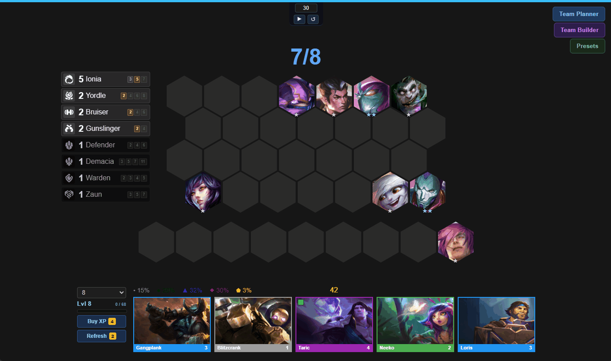
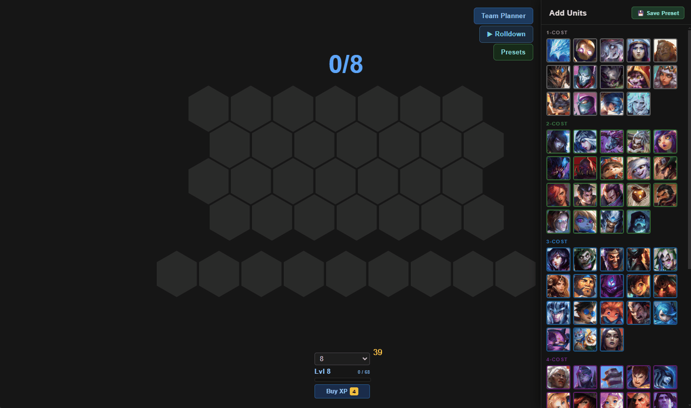
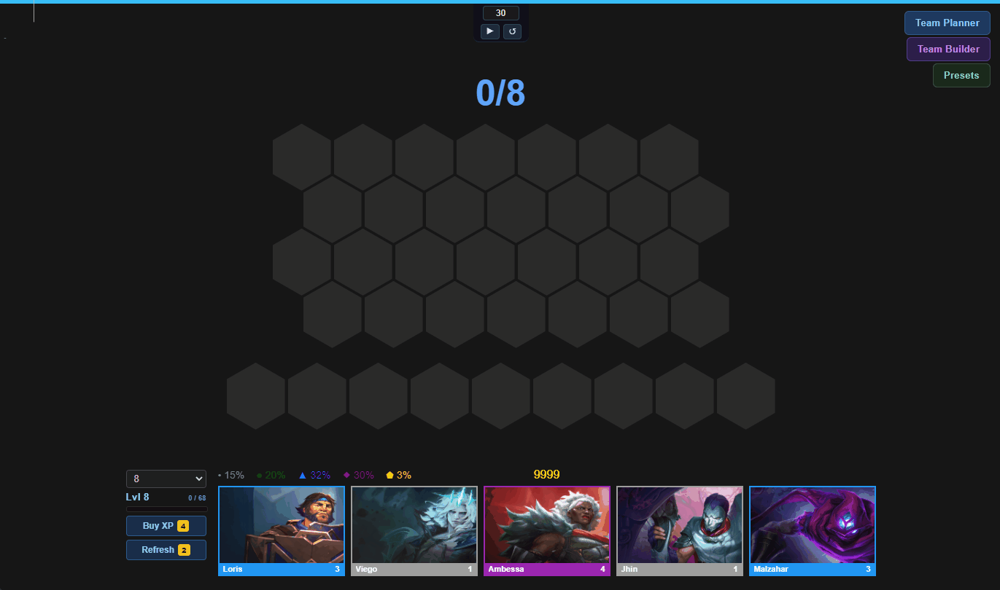

# Yet Another TFT Rolldown Simulator

A TFT Rolldown simulator for planning and practicing your rolldowns. Updated for Set 16. Web hosted version planned.

## Features

### Saving and Loading Teams
Design your own rolldown scenarios and load them easily with the Team Builder and Preset features!

## How to Run
Clone the repo and serve it locally. The easiest way is the VSCode [Live Server](https://marketplace.visualstudio.com/items?q=live%20server) extension.